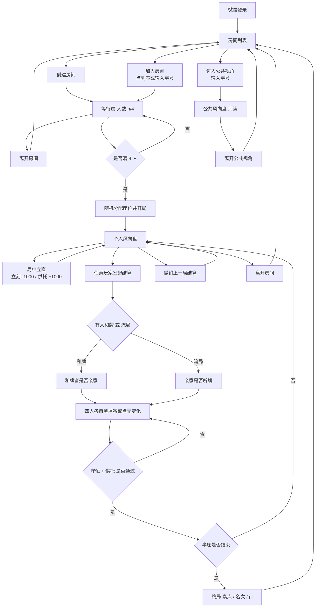
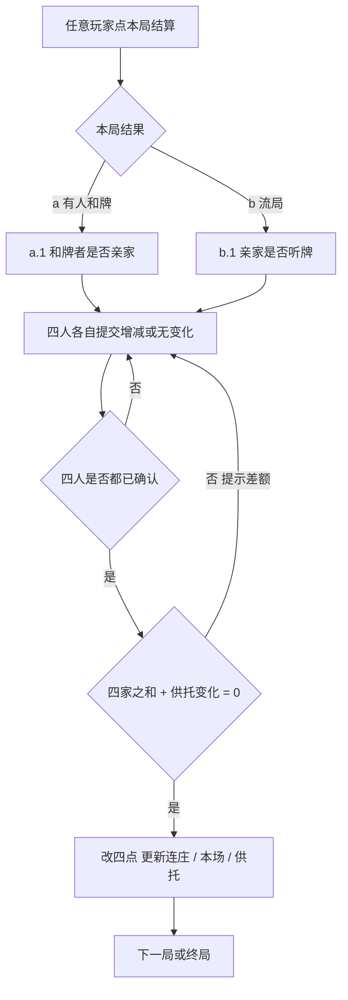

# 立直麻将 · 风向盘 — 用户流程

> 状态：草案 v0.5。与《功能需求》配套，确认大厅与对局怎么走。

## 1. 总流程

## 2. 按屏拆步骤

### 2.1 大厅（房间列表）

登录后的第一屏。

| 操作 | 说明 |
| --- | --- |
| 看列表 | 每条显示房号、人数 `n/4`、状态（等待中 / 对局中 / 已终局）、创建者 |
| 创建房间 | 自己成为房主，立刻进入等待房 |
| 加入房间 | 点一条「等待中且未满员」的房间，或手动输入房号 |
| 进入公共视角 | 输入房号，不占座位，进只读风向盘（桌中央设备用） |
| 刷新 | 更新房间列表 |

加入限制：

- 等待中且未满 4 人：可以加人入座。
- 对局中：不能再占座，只能走公共视角。
- 已终局：可进公共视角看结果，或只在列表里看到。
- 同一微信用户同一时间只在一个房间；要换房须先离开。

### 2.2 等待房

| 操作 | 说明 |
| --- | --- |
| 看成员 | 已加入的玩家头像 / 昵称，人数 `n/4` |
| 离开房间 | 回到大厅，人数 −1。房主离开则房间解散（等待中） |
| 自动开局 | 第 4 人到齐后，随机东 / 南 / 西 / 北，进入个人风向盘 |

### 2.3 个人风向盘（对局中）

自己在屏幕下方，左中右是对手。

| 操作 | 说明 |
| --- | --- |
| 立直 | 立刻自己 −1000，供托 +1000 |
| 取消本次立直 | 只还回这一根棒 |
| 发起结算 | 任意玩家；先选有人和牌或流局，再答亲家是否和 / 听 |
| 填分 | 输入自己增减，或点「无变化」并确认 |
| 撤销 | 任意玩家；回到上一局开始，可连续撤 |
| 离开房间 | 二次确认后回大厅。该座空出，缺人则四人确认凑不齐，对局暂停 |

### 2.4 公共风向盘

| 操作 | 说明 |
| --- | --- |
| 只看 | 局次、本场、供托、四家点数，绝对座位 |
| 离开 | 回大厅，不影响四人继续打 |

### 2.5 终局

展示素点、名次、pt。默认「返回大厅」。第一期不做「再来一局」自动重开（四人重新建房或再加入即可）。

## 3. 一局结算（放大）

不校验罚符金额。有人和牌则供托离桌（四家之和 = 当前供托）；流局则供托不动（四家之和 = 0）。

## 4. 实现默认（大厅相关）

1. 登录后先到房间列表，不直接建房。
2. 一人同时只呆在一个房间。
3. 等待中房主离开 = 解散房间；对局中离开只空座、不自动解散。
4. 对局中不能再加人占座。
5. 终局后回大厅；不做一键再来一局。
